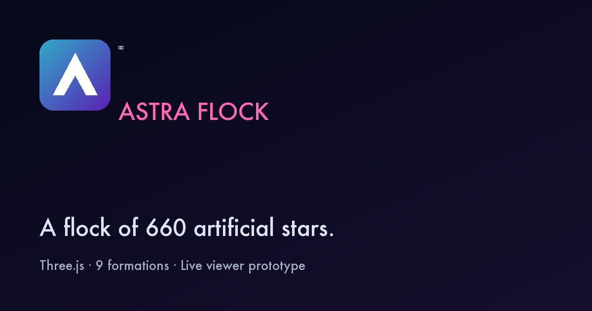

# Astra Flock — Drone Show

> **星群** — A flock of 660 artificial stars.

東京湾の夜空に 660 機のドローンで 9 演目を描く、Three.js ベースの観賞ビューアと
振付エディタ。静的サイト 1 枚で動作、ビルド不要。

**本番**: https://drone-show-simulator.vercel.app



---

## 機能ハイライト

### 観賞 (`/drone-show.html`)
- Three.js ポイントクラウドで **660 機 × 9 演目** を描画
- 演目: 球体 → 単螺旋 → 円環 → 波紋 → **熊 (Rilakkuma-ish)** → 二重螺旋 → 立方体 → 心臓 → **銀河 (フィナーレ)**
- 下から見上げる斜めカメラデフォルト、マウスドラッグ / ホイールでオービット
- キーボード: `Space` 再生, `←→` 演目, `1-9` ジャンプ, `+-` 速度, `F` 全画面, `S` スクリーンショット, `?` ヘルプ, `Esc` 閉じる
- `?f=<0..8>&speed=<n>` で URL deep-link、localStorage で設定永続化

### 振付エディタ (`/choreography.html`)
- 演目の **追加 / 複製 / 削除 / ↑↓ 並び替え**
- パラメータ (高度 / 広がり / 遷移速度 / 補間曲線 / パレット上書き / 配分機数) を
  全てプレビューに視覚反映
- 3D 投影プレビュー (show.js と同じ `FORMATIONS.targets` を Y 軸回転 + 透視投影で再現)
- **音源 upload** + 波形描画 (Web Audio API `decodeAudioData` + peak detection)
- 再生/停止/シーク/ループ同期、block 左端ハンドルドラッグで開始時刻調整
- **BPM + ビートグリッド** + snap-to-beat (threshold 0.2 beat)
- **JSON round-trip**: 演目書出 / 読込 / 名前付きプリセット (localStorage)
- **機体書出**: 実機連携用 flightpath JSON (schema `astra-flock-flightpath/1`)

### 運用 (`/fleet.html`, `/schedule.html`)
- Fleet: 660 機 roster + 詳細 drawer + 4 アクション (test/recalibrate/log/maint)
- Schedule: 月カレンダー + イベント drawer + pre-flight state サマリ + checklist

---

## クイックスタート

```bash
# ローカル起動
npm run dev
# → http://localhost:8080

# テスト (22 件, 200ms)
npm test

# 機体書出 JSON を再生デモ
npm run replay astra-flock-flightpath-2026-04-20.json [speed=20]
```

Python があれば `python3 -m http.server 8080` でも同じ。

---

## デプロイ (Vercel)

リポジトリを Vercel に接続すれば静的サイトとして自動認識。

- Framework Preset: **Other**
- Build Command: 空 (`npm run build` は no-op)
- Output Directory: `.` (`vercel.json` で設定)

`vercel.json` には以下を集約:

- `/` → `/drone-show.html` rewrite
- セキュリティヘッダ一式 (HSTS / CSP / COOP / X-Frame-Options / Permissions-Policy)

---

## アーキテクチャ

```
┌─ drone-show.html ─────────────────────── 観賞
│    └── show.js (Three.js scene + animation)
│         └── window.AstraFlock ← formations.js
│
├─ choreography.html ───────────────────── 振付
│    └── choreography.jsx (React via Babel standalone)
│         └── window.AstraFlock ← formations.js
│
├─ fleet.html / schedule.html ──────────── 運用
│    └── fleet.jsx / schedule.jsx
│         └── window.AstraFlock.FLEET ← formations.js
│
└─ formations.js (shared single source of truth)
     ├── FORMATIONS  (9 演目 + 位置計算関数)
     ├── PALETTES    (5 色パレット)
     ├── SKIES       (3 空パターン)
     ├── FLEET       (機体分布: total/active/charging/standby/maint)
     └── TOTAL_TIME
```

### ディレクトリ

```
.
├── drone-show.html        ─ メイン観賞ビュー
├── choreography.html/.jsx ─ 振付エディタ
├── fleet.html/.jsx        ─ 機体管理
├── schedule.html/.jsx     ─ 運航スケジュール
├── 404.html               ─ Not Found
├── formations.js          ─ 共有 FORMATIONS / PALETTES / FLEET
├── show.js                ─ Three.js シミュレーション
├── tokens.css             ─ デザイン token (色・タイポ)
├── app-chrome.css         ─ 運用 3 ページ共通 chrome
├── favicon.svg + PNG 一式 ─ favicon / apple-touch
├── og-image.png           ─ OG カード
├── sitemap.xml + robots.txt
├── vercel.json            ─ リライト + セキュリティヘッダ
├── test/                  ─ node:test (22 件)
├── tools/                 ─ flightpath-replay.mjs 等
└── .github/workflows/     ─ CI (npm test)
```

---

## セキュリティ

- 全外部 CDN (`unpkg.com`) には **SRI hash** (`integrity="sha384-..."`)
- CSP で `script-src / style-src / img-src / connect-src` 明示許可
- HSTS / X-Frame-Options DENY / COOP / Referrer-Policy
- localStorage にユーザー入力 (プリセット名等) 保存するが、React が JSX 挿入時に自動エスケープ

`script-src` に `'unsafe-eval'` が入っているのは `fleet/choreography/schedule.jsx` を
**Babel Standalone** で実行時トランスパイルしているため。JSX を事前ビルド
(Vite / esbuild) すれば外せる → 別 PR で検討。

---

## 開発コマンド

| Command | 内容 |
|---|---|
| `npm run dev` | `npx serve` で localhost:8080 起動 |
| `npm run build` | no-op (静的のため) |
| `npm run start` | 本番 serve (dev と同じ) |
| `npm test` | node:test で 22 件 (formations smoke + site smoke) |
| `npm run replay <file>` | flightpath JSON の CLI 再生デモ |

---

## ハンドオフ元

Claude Design (claude.ai/design) で HTML/CSS/JS プロトタイプとして作成されたものを、
コード実装向けにこのリポジトリへ移植。デザインの意図・使い方は
[`HANDOFF-README.md`](./HANDOFF-README.md) を参照。

## ライセンス / クレジット

- Three.js (MIT)
- React / React-DOM (MIT)
- Babel Standalone (MIT)
- Poppins / Shippori Mincho (Google Fonts, OFL)

本リポジトリ自体は内部 PoC。外部配布時はライセンス明記要。
