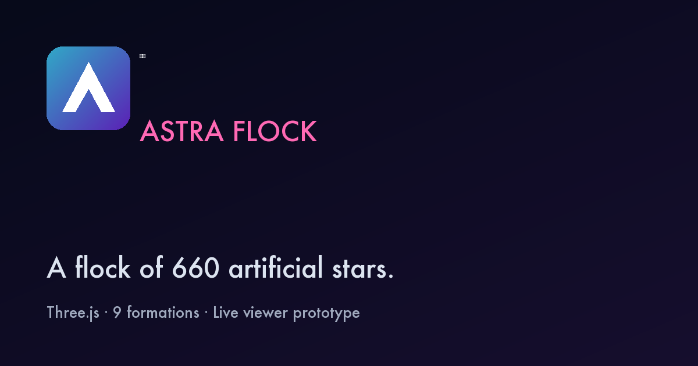

# Astra Flock — Drone Show

> **星群** — A flock of 660 artificial stars.

東京湾の夜空に 660 機のドローンで 9 演目を描く、Three.js ベースの観賞ビューアと
振付エディタ。Vite + React + TypeScript の SPA。

**本番**: https://drone-show-simulator.vercel.app



---

## 機能ハイライト

### 観賞 (`/`)
- Three.js ポイントクラウドで **660 機 × 9 演目** を描画
- 演目: 球体 → 単螺旋 → 円環 → 波紋 → **熊 (Rilakkuma-ish)** → 二重螺旋 → 立方体 → 心臓 → **銀河 (フィナーレ)**
- 下から見上げる斜めカメラデフォルト、マウスドラッグ / ホイールでオービット
- キーボード: `Space` 再生, `←→` 演目, `1-9` ジャンプ, `+-` 速度, `F` 全画面, `S` スクリーンショット, `?` ヘルプ, `Esc` 閉じる
- `?f=<0..8>&speed=<n>` で URL deep-link、localStorage で設定永続化

### 振付エディタ (`/choreography`)
- 演目の **追加 / 複製 / 削除 / ↑↓ 並び替え** + undo/redo (`Cmd/Ctrl+Z`, `Y`)
- パラメータ (高度 / 広がり / 遷移速度 / 補間曲線 / パレット上書き / 配分機数) を全てプレビューに視覚反映
- 3D 投影プレビュー (show と同じ `formations` を Y 軸回転 + 透視投影で再現)
- **音源 upload** + 波形描画 (Web Audio API `decodeAudioData` + peak detection)
- 再生/停止/シーク/ループ同期、block 左端ハンドルドラッグで開始時刻調整
- **BPM + ビートグリッド** + snap-to-beat (threshold 0.2 beat)
- **JSON round-trip**: 演目書出 / 読込 / 名前付きプリセット (localStorage)
- **機体書出**: 実機連携用 flightpath JSON (schema `astra-flock-flightpath/1`)

### 運用 (`/fleet`, `/schedule`)
- Fleet: 660 機 roster + 詳細 drawer + 4 アクション (test/recalibrate/log/maint), grid/table 切替
- Schedule: 月カレンダー + イベント drawer + pre-flight state サマリ + checklist

---

## クイックスタート

```bash
# 依存インストール (pnpm 必須、Node 22+)
pnpm install

# 開発サーバー (Vite, HMR)
pnpm dev
# → http://localhost:8080

# 本番ビルド (dist/)
pnpm build

# プレビュー (build 後)
pnpm preview
```

---

## デプロイ (Vercel)

`vercel.json` で Vite preset を明示。リポジトリを Vercel に接続すれば自動デプロイ。

| 設定 | 値 |
|---|---|
| Framework | `vite` |
| Build Command | `pnpm build` |
| Output Directory | `dist` |
| SPA fallback | `/(.*) → /index.html` |

セキュリティヘッダ一式 (HSTS / CSP / COOP / X-Frame-Options / Permissions-Policy) も `vercel.json` に集約。CSP は `script-src 'self'` のみで `unsafe-eval` 不要 (Vite ビルド済 JS のため)。

---

## アーキテクチャ

```
src/
├── main.tsx              ─ React + React Router エントリ
├── routes/
│   ├── show/             ─ Three.js scene を React でラップ
│   ├── choreography/     ─ store + components + audio sync
│   ├── fleet/            ─ roster + grid/table + drawer
│   ├── schedule/         ─ Calendar + EventDrawer
│   └── NotFoundPage.tsx  ─ 404 (React Router catch-all)
├── components/           ─ 共通 UI primitives + icons
├── hooks/                ─ useDirty, useKeyboard 等
├── lib/                  ─ formations / showSchema / shapes (純粋関数)
├── data/                 ─ fleet / schedule の typed data
├── styles/               ─ tokens.css + chrome.css + global.css + reset.css
├── types/
└── test/                 ─ vitest setup
```

ルーティングは React Router v6。各 route 配下に専用 components/ + hooks/ + types.ts。

---

## セキュリティ

- CSP `default-src 'self'` 基線 + `script-src 'self'` (CDN 経由スクリプト無し)
- Google Fonts (`fonts.googleapis.com` / `fonts.gstatic.com`) のみ style/font で許可
- HSTS / X-Frame-Options DENY / COOP same-origin / Referrer-Policy `strict-origin-when-cross-origin`
- localStorage 入出力は JSON.parse 失敗時にデフォルト fallback

---

## 開発コマンド

| Command | 内容 |
|---|---|
| `pnpm dev` | Vite dev サーバー (HMR, http://localhost:8080) |
| `pnpm build` | 本番ビルド → `dist/` |
| `pnpm preview` | build 成果物のローカル配信 (http://localhost:8080) |
| `pnpm typecheck` | `tsc -b --pretty` |
| `pnpm lint` | ESLint (`--max-warnings=0`) |
| `pnpm lint:fix` | ESLint + autofix |
| `pnpm format` / `format:check` | Prettier |
| `pnpm test` | Vitest (113 件, ~2s) |
| `pnpm test:watch` / `test:coverage` | watch / カバレッジ |
| `pnpm test:e2e` | Playwright E2E (18 件, chromium) |
| `pnpm test:e2e:install` | chromium ブラウザ初回取得 |
| `pnpm test:e2e:ui` | Playwright UI モード |
| `pnpm replay <file>` | flightpath JSON の CLI 再生デモ |

### pre-commit

`husky` + `lint-staged` で staged ファイルのみ:
- `*.{ts,tsx}` → `eslint --fix --no-warn-ignored` + `prettier`
- 他 → `prettier`

Vitest / E2E は CI 側で担保。

---

## CI

`.github/workflows/test.yml` (push to main / 全 pull_request):
- `test` job: lint → typecheck → format:check → vitest → replay syntax → build
- `e2e` job (`needs: test`): chromium キャッシュ → build → playwright → report artifact

---

## ハンドオフ元

Claude Design (claude.ai/design) で HTML/CSS/JS プロトタイプとして作成されたものを、React SPA として再実装。デザインの意図・使い方は [`HANDOFF-README.md`](./HANDOFF-README.md) を参照。

## ライセンス / クレジット

- Three.js (MIT) / React / React-DOM / React Router (MIT)
- Poppins / Shippori Mincho (Google Fonts, OFL)

本リポジトリ自体は内部 PoC。外部配布時はライセンス明記要。
